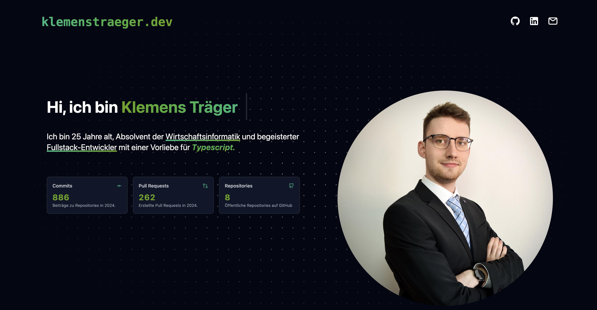

# Portfolio Website



A modern portfolio website built with Nuxt 3 that showcases my projects, skills, and experience.

## Features

- 🌍 Multilingual support (English/German)
- 🎨 Modern design with TailwindCSS
- ⚡️ Server-side rendering with Nuxt 3
- 📱 Fully responsive layout
- 📊 GitHub statistics integration
- 🖼️ Image optimization with Nuxt Image
- 🚀 Performance optimized

## Tech Stack

- [Nuxt 3](https://nuxt.com/) - Vue.js Framework
- [TailwindCSS](https://tailwindcss.com/) - CSS Framework
- [Inspira UI](https://inspira-ui.com/) - Component Library
- [TypeScript](https://www.typescriptlang.org/) - Type Safety
- [i18n](https://i18n.nuxtjs.org/) - Internationalization

## Setup

Make sure to install the dependencies:

```bash
pnpm install
```

## Production

Build for production:

```bash
pnpm build
```

Preview production build:

```bash
pnpm preview
```
